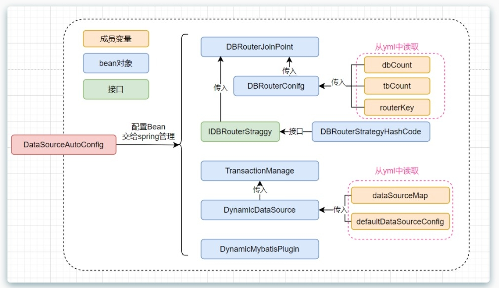
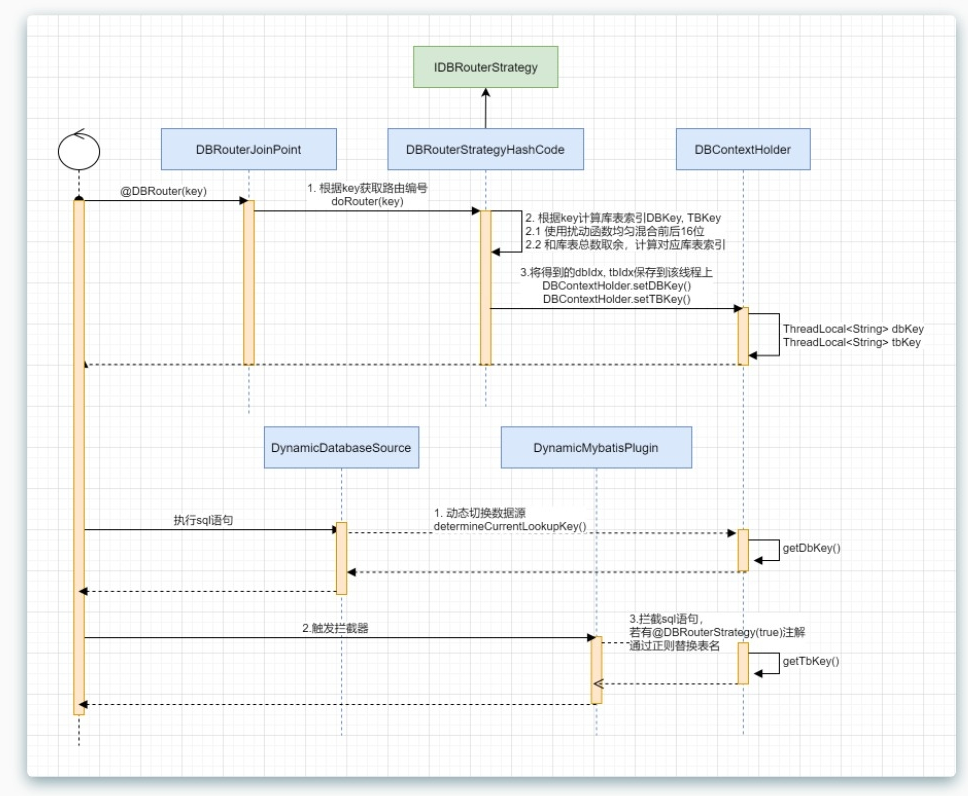

# db-router-springboot-starter
**基于 HashMap 核心设计原理，使用哈希散列+扰动函数的方式，把数据散列到多个库表中的组件。**

分库分表操作主要有垂直拆分和水平拆分：

- 垂直拆分：指按照业务将表进行分类，分布到不同的数据库上，这样也就将数据的压力分担到不同的库上面。最终一个数据库由很多表的构成，每个表对应着不同的业务，也就是专库专用。
- 水平拆分：如果垂直拆分后遇到单机瓶颈，可以使用水平拆分。相对于垂直拆分的区别是：垂直拆分是把不同的表拆到不同的数据库中，而本章节需要实现的水平拆分，是把同一个表拆到不同的数据库中。如：user_001、user_002

## 思路
- 分库：通过AOP的方式，拦截@dbRouter注解，通过一致性Hash计算目标数据源，缓存到TreadLocal里。配置DynamicDataSource,从ThreadLocal中读取目标数据源key执行切换。
- 分表：利用MyBatis拦截器，在@DBRouterStrategy(true)标记的类里，从ThreadLocal中读取目标表ID,替换SQL语句。

## 类图解


## 时序图


## application.yml 配置
```yaml
simple-db-router:
  jdbc:
    datasource:
    	# 分库数量
      dbCount: 2
      # 分表数量
      tbCount: 4
      # 默认路由键
      defaultRouterKey: id
      # 默认数据源
      defaultDataSource: db00
      # 数据源列表
      dbList: db01,db02
      
      db00:
      	# 如果是单节点只需要配置 write
        write:
          driver-class-name: com.mysql.jdbc.Driver
          url: jdbc:mysql://127.0.0.1:3306/db
          username: root
          password: root
        # 读写分离时 读节点列表
        readList: db00Read00,db00Read01
        db00Read00:
          driver-class-name: com.mysql.jdbc.Driver
          url: jdbc:mysql://127.0.0.1:3306/db
          username: root
          password: root
        db00Read01:
          driver-class-name: com.mysql.jdbc.Driver
          url: jdbc:mysql://127.0.0.1:3306/db
          username: root
          password: root
```
## DbRouter 注解使用
```java
@Mapper
// 默认不分表，分表需显示添加
@DbRouter(needSplitTable = true)
public interface IUserDao {

    @DbRouter(splitKey = "userId")
    int insert(User user);

    @DbRouter(splitKey = "userId")
    int updatePassword(User user);
}
```
